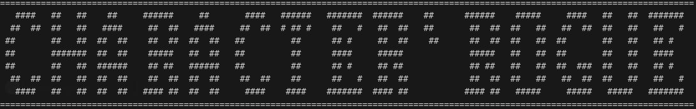
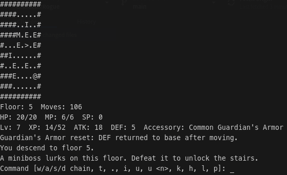

CUIで遊べる、1人用ローグライクボードゲームです。  
ランダム生成されるフロアを探索し、敵・中ボス・ボスを撃破しながら、できるだけ深い階層と高スコアを目指します。



---

## 目次

- [実行方法](#実行方法)
- [ゲーム開始と難易度](#ゲーム開始と難易度)
- [操作方法](#操作方法)
- [画面表示・UIの見方](#画面表示uiの見方)
- [ゲーム進行ルール](#ゲーム進行ルール)
- [ランダムイベント](#ランダムイベント)
- [成長システム](#成長システム)
- [アイテムとアクセサリ](#アイテムとアクセサリ)
- [Arcana（魔法）](#arcana魔法)
- [友好キャラクター](#友好キャラクター)
- [スコア](#スコア)
- [テスト](#テスト)

---

## 実行方法

### 必要環境
- Python 3.10+

### 起動

```bash
python game.py
```

---

## ゲーム開始と難易度

タイトル画面で以下を選択できます。

1. Start
2. Change Difficulty
3. Quit

難易度は以下の4種類です。

- Easy
- Normal
- Hard
- Lunatic

難易度は敵ステータス倍率に影響します。

---

## 操作方法

### ターン消費する行動
- `w` / `a` / `s` / `d`: 移動（敵にぶつかると通常攻撃）
- `wwd` のような連続入力: 1ターン中に連続移動（装備により最大入力数が変化）
- `.`: 待機
- `t`: Arcana（魔法）使用
- `u`: アイテム使用（自動選択）
- `u <番号>`: 指定スロットのアイテム使用（例: `u 3`）
- `k`: スキルツリーを開いてSP消費
- `kv` / `ks` / `kg` / `ka`（または `k v` 形式）: スキルを直接使用

### ターン消費しない表示系
- `i`: インベントリ表示
- `l`: ターンログ表示
- `p`: 詳細ステータス表示
- `h`: ヘルプ表示

---

## 画面表示・UIの見方

### マップ記号
- `#`: 壁
- `.`: 床
- `,`: ボスレーザー予告
- `@`: プレイヤー
- `E`: 通常敵
- `e`: 要塞敵（Fortified）
- `M`: 中ボス
- `B`: ボス
- `I`: アイテム
- `$`: merchant / technician
- `%`: friendly demon
- `?`: maze traveler
- `>`: 階段

### ステータス表示（3行）
1. Floor / Moves
2. HP / MP / SP
3. Lv / XP / ATK / DEF / 装備アクセサリ

---

## ゲーム進行ルール

### 基本
- ダメージ計算: `max(1, attacker_atk - defender_def)`
- プレイヤーHPが0以下でゲームオーバー
- 階段 `>` で次フロアへ進行

### フロア構成
- **5, 15, 25...階**: 中ボス階（撃破まで階段封印）
- **10, 20, 30...階**: ボス階（撃破まで階段封印）
- **11, 21, 31...階**: 新しい周回
  - マップ横幅が増加
  - 敵が強化

### 特殊敵
- **要塞敵（e）**
  - 10階層サイクルごとに最大1体、低確率で出現
  - 非常に高防御・ATK0
  - 撃破時に大量XP
  - プレイヤーから距離を取るように移動

### ボスの行動
- 通常攻撃/召喚/レーザー予告をランダム実行
- レーザー予告ターンの次に十字方向へレーザー攻撃
- HPが一定以下になると一度だけ強化・再生

---

## ランダムイベント

フロア生成時に低確率で発生します。

- **Lucky Day**（約2%）
  - その階での獲得XPが2倍
- **Full Moon Night**（約1%）
  - ターン開始時に最大HP/MPの5%回復
- **TRAP**（約1%）
  - 敵数・アイテム数が1.5倍

---

## 成長システム

### レベルアップ
- 敵撃破やフロア制圧ボーナスでXP獲得
- レベルアップ時:
  - 最大HP / 最大MP / ATK / DEF が成長
  - HP / MP 全回復
  - SP +1

### スキルツリー（`k`）
- `v` Vitality: 最大HP +3
- `s` Strength: ATK +2
- `g` Guard: DEF +2
- `a` Arcane: ランダムArcanaを習得（1枠なので入れ替え選択あり）

---

## アイテムとアクセサリ

### 消費アイテム
- `Potion`: HP回復（レアリティで回復量増）
- `Power`: ATK上昇
- `Shield`: DEF上昇
- `Ether`: MP回復（レアリティで回復量増）
- `Throwing axe`: 指定方向の直線上、最初の敵へダメージ
- `Bomb`: その階の全敵にダメージ

### レアリティ
- Common / Uncommon / Rare / Epic / Legendary
- 高レアほど効果が強い

### アクセサリ
- `Lucky amulet`: 獲得XP倍率アップ
- `Kote`: ATK/DEF上昇
- `Vampire's Fang`: HP回復の余剰分をMPへ変換
- `Dark Wizard's Staff`: MP回復の余剰分をHPへ変換
- `Guardian's Armor`: 待機でDEF倍率スタック、移動でリセット
- `Berserker's club`: 最大MPを0にし、ATK倍率アップ
- `Roller shoes`: 1ターン中の連続移動上限を増加
- `Gunpowder box`: 撃破時の超過ダメージを隣接敵へ連鎖

※アクセサリは1つだけ装備可能。装備変更時は旧装備がインベントリへ戻ります。

---

## Arcana（魔法）

Arcanaは **1つだけ所持** できます（新規習得時に入れ替え選択）。

- `Comet Missile`: 直線上の敵1体に攻撃
- `Flare Curtain`: 周囲8マスの敵を同時攻撃
- `God's Wrath`: 次の通常攻撃を強化するチャージを付与（重ね掛け可）
- `Healing`: 自身のHP回復
- `Vampire Kiss`: 隣接敵1体に攻撃＋吸収回復
- `Frugal soul`: 次に使うアイテムを確率で非消費化

---

## 友好キャラクター

友好キャラクターは接触で取引/イベントが発生します。  
各フロアで出現判定があり、10階層サイクル中に同じ役職は1回まで出現します。

### 役職と重み
- merchant: 10
- technician: 10
- maze traveler: 2
- friendly demon: 2

### 効果
- **merchant**
  - インベントリ1〜5個を別アイテム1個に交換
  - 所持0個ならCommonアイテムを1個支給
- **technician**
  - インベントリ1〜5個をArcana1つに変換
  - 所持0個ならCommon Arcanaを1つ支給
- **maze traveler**
  - 次の階段移動先を「現在階層の2倍」または「半分」に変更
- **friendly demon**
  - HPを1以上残す範囲で任意量を捧げ、ATK/DEFへ配分して上昇

---

## スコア

ゲームオーバー時のスコアは主に以下で算出されます。

- 到達階層
- レベル
- 最終ステータス（最大HP/最大MP/ATK/DEF）
- スキル取得数
- 所持Arcanaのレアリティ

深く潜り、ステータスとArcana品質を高めるほど高スコアになります。

---

## テスト

```bash
python3 -m unittest discover -s tests -v
```
